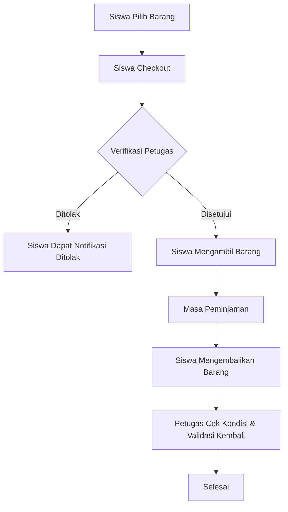

# 📘 BUKU MANUAL LENGKAP: SISTEM 4LLASET
**Sistem Peminjaman Aset Jurusan (Premium Edition)**

Sistem 4LLASET adalah platform manajemen aset sekolah yang mengintegrasikan dashboard web Laravel untuk administrasi dan aplikasi mobile/web Flutter untuk pengalaman pengguna yang modern dan efisien.

---

## 📋 DAFTAR ISI
1. [Gambaran Umum Sistem](#1-gambaran-umum-sistem)
2. [Prasyarat & Instalasi](#2-prasyarat--instalasi)
3. [Panduan Peran: SISWA (Aplikasi Flutter)](#3-panduan-peran-siswa-aplikasi-flutter)
4. [Panduan Peran: PETUGAS (Aplikasi & Web)](#4-panduan-peran-petugas-aplikasi--web)
5. [Panduan Peran: ADMIN (Dashboard Web)](#5-panduan-peran-admin-dashboard-web)
6. [Alur Kerja Peminjaman (Workflow)](#6-alur-kerja-peminjaman-workflow)
7. [Pemecahan Masalah (Troubleshooting)](#7-pemecahan-masalah-troubleshooting)

---

---

## 🔑 Akun Pengujian (Testing Accounts)
Berikut adalah akun yang dapat digunakan untuk menguji sistem (Password default: `password`):
*   **ADMIN**: `admin@aset.com`
*   **PETUGAS (Officer RPL)**: `officer.rpl@smkn4bdg.sch.id`
*   **SISWA (Student RPL)**: `student.rpl001@smkn4bdg.sch.id`

---

## 1. Gambaran Umum Sistem
Sistem ini membagi fungsi utama ke dalam 3 level akses:
*   **Siswa:** Fokus pada peminjaman barang secara mandiri.
*   **Petugas Jurusan:** Fokus pada verifikasi barang sesuai keahlian jurusannya.
*   **Admin:** Fokus pada manajemen database, user, dan pemantauan sistem secara menyeluruh.

---

## 2. Prasyarat & Instalasi

### 🛠️ Prasyarat Sistem (Requirements)
Sebelum memulai, pastikan perangkat Anda memiliki:
*   **Web Server**: PHP 8.0.2 atau lebih tinggi & MySQL (XAMPP/Laragon direkomendasikan).
*   **Flutter SDK**: Versi 3.2.3 atau lebih tinggi.
*   **Node.js**: Untuk sinkronisasi aset (Vite) di Laravel.
*   **Alat Bantu**: Composer (PHP), NPM (Node.js), dan **Mailpit** (untuk pengujian email).

### 📦 Daftar Package/Library Utama
Sistem ini menggunakan beberapa library penting yang akan terinstall otomatis saat perintah instalasi dijalankan:

**Backend (Laravel):**
*   `maatwebsite/excel`: Untuk ekspor laporan.
*   `barryvdh/laravel-dompdf`: Untuk pembuatan PDF.
*   `pusher/pusher-php-server`: Untuk sistem notifikasi real-time (Opsional).
*   `laravel/sanctum`: Untuk otentikasi API yang aman.
*   `barryvdh/laravel-cors`: Menangani izin akses dari Flutter.

**Frontend (Flutter):**
*   `provider`: Manajemen state aplikasi.
*   `http` & `http_parser`: Komunikasi dengan API Laravel.
*   `google_fonts` & `font_awesome_flutter`: UI & Ikon Premium.
*   `cached_network_image`: Cache gambar untuk performa cepat.
*   `fl_chart`: Menampilkan statistik grafik di dashboard.

---

### 🚀 Panduan Instalasi

#### Persiapan Backend (Laravel)
1.  Pastikan Server PHP (XAMPP/Laragon) aktif.
2.  Masuk ke direktori `AppPeminjamanAsetJurusan`.
3.  Jalankan perintah:
    ```bash
    composer install
    npm install && npm run build
    php artisan migrate:fresh --seed
    php artisan storage:link
    php artisan serve
    ```
4.  Akses dashboard di: `http://localhost:8000`

#### Persiapan Email Testing (Mailpit)
Untuk melakukan pengujian verifikasi email secara lokal:
1.  Buka terminal baru di folder utama.
2.  Jalankan file mailpit:
    ```bash
    ./mailpit.exe
    ```
3.  Akses dashboard Mailpit di: `http://localhost:8025` untuk melihat email yang masuk.

#### Persiapan Frontend (Flutter)
1.  Masuk ke direktori `4LLASETFlutter`.
2.  Buka file `lib/services/api_service.dart`.
3.  Ubah `BASE_URL` sesuai dengan IP komputer server.
4.  Jalankan perintah:
    ```bash
    flutter pub get
    flutter run -d chrome  # Untuk Web atau HP
    ```

---

## 3. Panduan Peran: SISWA (Aplikasi Flutter)

### A. Login & Registrasi
*   Gunakan akun yang telah didaftarkan Admin.
*   Setelah login, Anda akan masuk ke **Beranda (Dashboard)** yang menampilkan riwayat aktif Anda.

### B. Proses Peminjaman
1.  Buka menu **Katalog/Asset** (Ikon Kotak).
2.  Pilih **Jurusan** yang sesuai.
3.  Pilih barang yang ingin dipinjam.
4.  Klik tombol **"Pinjam Aset"**.
5.  Atur jumlah barang dan pastikan stok tersedia.
6.  Klik ikon **Keranjang** di pojok kanan bawah.
7.  Isi form Checkout (Tujuan & Waktu).
8.  Klik **"AJUKAN PINJAMAN"**.

---

## 4. Panduan Peran: PETUGAS (Aplikasi & Web)

### A. Verifikasi Peminjaman
1.  Masuk ke menu **Status Peminjaman** di aplikasi Flutter.
2.  Klik pada permintaan yang berstatus "MENUNGGU".
3.  Klik tombol **"SETUJUI TERPILIH"** atau **"TOLAK"**.

### B. Proses Pengembalian
1.  Klik tombol **"KEMBALIKAN TERPILIH"** pada detail transaksi.
2.  Update kondisi barang (Baik/Rusak).

---

## 5. Panduan Peran: ADMIN (Dashboard Web)

1.  **Manajemen User:** Menu `Laporan Data > Data User`.
2.  **Manajemen Aset:** Tambah aset baru dan setel jurusan ke "Semua" jika bersifat umum.
3.  **Monitoring Global:** Lihat grafik aktivitas di menu Home.

---

## 6. Alur Kerja Peminjaman (Workflow)



---

## 7. Pemecahan Masalah (Troubleshooting)

| Masalah | Penyebab | Solusi |
| :--- | :--- | :--- |
| **Gambar Aset Tidak Muncul** | Link Storage belum aktif | Jalankan `php artisan storage:link` |
| **Login Gagal (Invalid)** | Password salah / User belum diverifikasi | Cek status User di Dashboard Admin |
| **Aplikasi Flutter Stuck Loading** | Backend (Laravel) mati | Pastikan `php artisan serve` berjalan |

---
*Manual Book ini diperbarui secara otomatis per April 2026 oleh Antigravity AI.*
